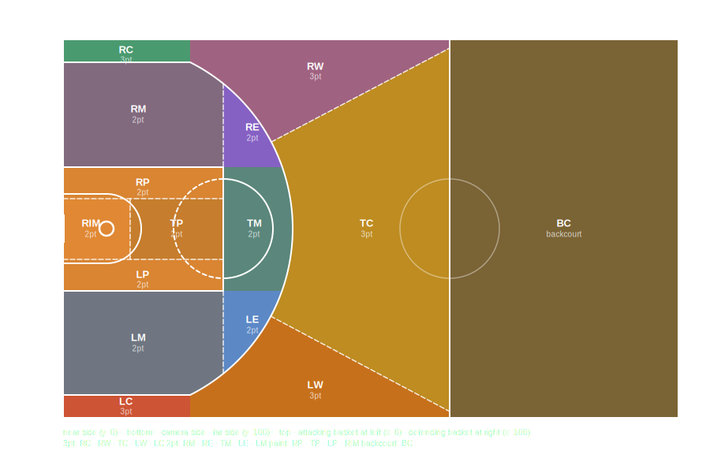

# BGDL (BigDill) - a language for describing basketball games

## Purpose

BGDL is intended to allow a skilled user to quickly record events in a basketball game (in realtime, or while watching a video of the game), in a format that will allow later processing to:

* generate human readable play by plays, boxscores, and other statistics
* find portions of video that show specific events in a game for later retrieval (for example, to allow retrieval of videos of all 3 point attempts by a particular player in a season)

BGDL is also intended to facilitate interoperability between different systems that create, archive or display 'Play By Play' records of basketball games.

## Design Goals

* quick and easy for an expert user to manually enter
* easy to convert to a human readable 'play by play'
* facilitates interoperability between different software applications
* describe all elements of a basketball game that are currently recorded by sideline statisticians conforming to [FIBA Statisticians Manual](https://nz.basketball/wp-content/uploads/2024/10/FIBA-Statisticians-Manual-2024-1.0.pdf)
* simplifies synchronization between game clock and wall clock, allowing for errors and discontinuities in both

## Inspirations

<https://www.willhart.io/post/basketball-analysis-software/#building-a-tagging-software>
<https://en.wikipedia.org/wiki/Algebraic_notation_(chess)>

# BGDL format

A BGDL file (or record) consists of:

* A header containing zero or more metadata records about the game being described, followed by
* zero or more game event detail records describing events in the game

## Comments

A `#` character is used to mark the start of a comment, and all text from a `#` to the end of the line will be ignored. Lines consisting solely of whitespace or comments are ignored.

## Header

A header contains tags, one per line, containing information about the game.
Each tag consists of a single uppercase word followed by a colon and then a tag value.
Whitespace on either side of the colon is allowed but not required.

| Tag | Samples | Description |
| --- | --- | --- |
| GAME | `GAME: Waratah 1 Youth Men Grand Final 2025` | Free form text that can be used by a human to distinguish this game from any others |
| GAME\_ID | `YLM1::776812` | Free form ID field that can be used to uniquely identify this game during machine processing of BGDL data |
| PERIODS | `PERIODS: 4x10+5` `PERIODS:2 X 20` | The number and duration of periods during a standard game (separated by an 'x' or 'X'), optionally followed by a plus sign and then the duration of any overtime periods, whether or not overtime was required in this game |
| DATE | `DATE:2025-08-24` `DATE: 2025-08-24T11:00:00` `DATE:2025-08-24T11:00:00+10:00` | Game date (possibly with time) in any valid ISO 8601 format |
| VIDEO | `VIDEO: https://www.youtube.com/watch?v=odm3WiK5wC4` | URL of a video of the game |
| A | `A: Bankstown Bruins` `A:BAN,Blue` `A: BAN/Bankstown Bruins` | Name (or team code) of 'Team A' (sometimes called the Home team). Optionally, the team name/code may be followed by a comma and then the predominant colour of the jersey worn by this team in this game. Alternatively, a short team code may be specified before a '/' separator followed by the full team name (see Team Codes below) |
| B | `B: Hills Hornets` `B:HIL, Green` `B: HIL/Hills Hornets` | Name (or team code) of 'Team B' (sometimes called the Away team). Optionally, the team name/code may be followed by a comma and then the predominant colour of the jersey worn by this team in this game. Alternatively, a short team code may be specified before a '/' separator followed by the full team name (see Team Codes below) |
| VENUE | `VENUE: Sydney Olympic Park` | The name of the venue where the game was played |
| GAME\_WEBPAGE | `GAME_WEBPAGE: https://nbl1.com.au/game?id=abc123` | URL of the official game page on the competition website |

### Team Codes

When specifying team names in the A and B header tags, an explicit short team code can be provided using the `CODE/Full Name` convention. The text before the `/` is used as the team code (typically 2-4 uppercase characters), and the text after the `/` is the full team name. For example:

```
A: BAN/Bankstown Bruins
B: IWB/Inner West Bulls
```

This is useful when the full team name does not lend itself to automatic code derivation (e.g. multiple teams starting with "St").

If no `/` is present, the team code is derived automatically from the team name (implementation-defined).

### Rosters

Player rosters may be included in the header. Where any roster records are provided for a team, a complete roster for that team SHOULD be provided, however processors should not rely on that. It is acceptable to provide a roster for one team only.

A roster record consists of the letter `R`, immediately followed by the team letter (`A` or `B`), immediately followed by the jersey number — with no spaces between these three elements. This may optionally be followed by whitespace and then a player name. A player name may in turn be followed by optional whitespace, a comma, and a free-form player ID that could be used to track a player across multiple games. Where a player ID is known but the player name is not, `-` should be used as a placeholder for the name.

```
# Team A roster (Bankstown Bruins):
RA8 John Smith, XX-91267
RA00 -, XX-91929
RA1 Lee Yuan, XX-9159

# Team B roster (Inner West Bulls):
RB7 Mark Jones, XX-84312
RB14 Sam Park
```

Any other information about players or teams that does not fit the structured roster format above may be included as free-form comments in the header using the standard `#` comment syntax.

## Game Event Detail Records

A Game Event Detail Record consists of:

1. a Time Tag (wall clock, optionally inclusive of game clock)
2. an Event Type Identifier
3. Event Data

### Time Tags

A Time Tag consists of a Wall Clock value (or a `-` placeholder), and (optionally) whitespace followed by a Game Clock value.

#### Wall Clock

Wall clock may be recorded in absolute terms (for example as a full ISO-8601 datetime), or relative to some base time (for example, the start of a video — where an event with time tag '3:51' occurs at 3 minutes and 51 seconds into that video).

At minimum, a time tag consists of one or 2 digits of minutes, followed by a colon, followed by seconds, e.g. `0:01`, `00:35`, `31:54`.

Optionally, a time tag can contain one or 2 digits of hours, and/or fractions of seconds, e.g. `01:32:35`, `01:32:35.276`, `19:41.2`.

The wall clock MAY be *preceded* by whitespace, but there MUST NOT be whitespace *within* the wall clock value. e.g. `03:12` is valid, but `03 : 12` is not.

Where the wall clock time is not known, a single `-` character shall be used as a placeholder. When `-` is used, a Game Clock value SHOULD be provided so that the event can still be placed in game time. e.g. `- P2T07:31 2pt+A12`

#### Game Clock

After any Wall Clock tag, separated with whitespace, a Game Clock may be specified.
Whenever a Game Clock time is specified, it shall be in the form `PnTmm:ss` where `n` is the period number.
In a FIBA standard game, the tipoff would occur at `P1T10:00`, and `P6T00:03.27` would represent 3.27 seconds remaining in a 2nd overtime period.

### Event Type Identifiers

An Event Type Identifier is a short code which specifies the type of event being recorded.

#### Game Clock Events

These events are used to start/stop the game clock, and synchronize the game clock and wall clock.

| Event Type Identifier | Meaning | Event Data | Example Detail Record |
| --- | --- | --- | --- |
| start | Game Clock is started | n/a | `01:02 P1T10:00 start` |
| stop | Game Clock is stopped (i.e. ref has blown whistle) | n/a | `01:53 P1T9:21 stop` |
| sync | Game state is unchanged but is used only to synchronize the game clock and wall clock | n/a | `31:27 p2t05:16 sync` |

#### Lineups

These events are used to specify the players on the court for a given team.
For a lineup event, the Event Data shall be a comma delimited list of the jersey numbers for players on court for a single team. In all but the most exceptional circumstances, this should be 5 players.

| Event Type Identifier | Meaning | Example Detail Record |
| --- | --- | --- |
| la | Lineup for Team A | `01:05 P1T10:00 la 4,7,11,14,21` |
| lb | Lineup for Team B | `01:05 P1T10:00 lb 5,8,10,13,23` |

#### Violations

These events are used to record a violation against a team or player.
Event Data for such events is either a single team (identified by letter `A` for "Team A"/Home team or `B` for "Team B"/Away team), OR an individual player, identified by a letter (A or B) followed by digits representing the jersey number of the player, e.g. `A1` or `b27`.

| Event Type Identifier | Meaning | Event Data | Example Detail Record |
| --- | --- | --- | --- |
| travel | Travel | Team or Player who was called for travelling | `02:41 travel b27` |
| out | Out of Bounds | Team or Player that last touched the ball before it went out of bounds | `02:41 out A` |
| back | Backcourt Violation | Team or player that touched the ball after it crossed back into the backcourt | `12:47 P1T7:17 back B9` |
| double | Double Dribble | Team or player that double dribbled | `8:16 double A4` |
| shotclock | Shot Clock violation | Team in possession when shot clock expired | `8:16 shotclock b` |
| 3s | Three Second violation — too long in restricted area | Team or player penalised | `8:16 3s A8` |
| 5s | Five Second violation — holding ball too long before inbounding or while closely guarded | Team or player penalised | `8:16 5s A8` |
| 8s | Eight Second violation — taking too long to advance ball over halfway | Team or player penalised | `8:16 8s A8` |

#### Shot Attempts

These events are used to record a shot attempt, whether successful or not.
Event Data for such events always includes:

* The shot type (per the table below)
* A `+` if the shot was successful and a `-` if the shot was unsuccessful
* The individual player who attempted the shot, identified by a letter (A or B) followed by digits representing the jersey number of the player, e.g. `A1` or `b27`. e.g. `23:14 2pt-A15` is an unsuccessful 2pt attempt by the player from Team A wearing jersey 15
* If the shot was assisted, then there shall be another `+` followed by the jersey number of the player who made the assist (as this is always a team member of the shooter, the team (A or B) is not separately specified). The assist is always recorded on the field goal attempt (whether it was made or missed), not on any subsequent free throws. When computing assist statistics from BGDL, an assist on a missed field goal that was accompanied by a shooting foul should only be credited if at least one of the resulting free throws was made
* If the shooter was fouled while shooting, this is indicated by `SF` (for an ordinary shooting foul), `UF` for an Unsportsmanlike Foul, and `DQ` for a Disqualifying foul, followed by the team and jersey number of the player charged with the foul (i.e. the opponent of the shooter)
* If a basket is both assisted and results in a shooting foul, the assist shall appear before the shooting foul, e.g. `23:14 2pt+A15+8SFB19`
* If a shot attempt is blocked by a defender (which by definition means the shot is unsuccessful and no foul is called on the defender), this is indicated by `BL` followed by the team and jersey number of the player that made the block (i.e. the opponent of the shooter)
* Optionally the Event Data may include a shot location — see the Regions and Locations section below for the two supported formats

##### Shot Types

| Event Type Identifier | Meaning | Example Detail Record |
| --- | --- | --- |
| 2pt | 2 Point Shot | `23:14 2pt+A15+8SFB19` |
| 3pt | 3 Point Shot | `19:17 3pt-B28 UFA9 @(43,43)` |
| dunk | Dunk | `1:03:17 dunk-A22 BLB1 @RIM` |
| pb | Put Back | `43:49 pb+B18` |
| ft | Free Throw | `41:43 P4T7:13 ft-` |

Note — a 'Put Back' will ALSO result in an offensive rebound being credited to the player specified.

##### Shot Event Modifiers

As described above, the following additional event types may be recorded as part of a Shot Attempt Event.

| Event Type Identifier | Meaning | Event Data |
| --- | --- | --- |
| SF | Shooting Foul | Defender charged with the foul |
| UF | Unsportsmanlike Foul | Defender charged with the foul |
| DQ | Disqualifying Foul | Defender charged with the foul |
| BL | Block | Defender that blocked the shot |

##### Regions and Locations

Locations can optionally be specified on any event where court position is meaningful: shot attempts, rebounds, fouls, turnovers, steals, violations (travel, out of bounds). Locations are not meaningful on free throws, timeouts, or substitutions. Two formats are supported, which may be used independently or together on the same event:

**Absolute coordinates** use the syntax `@(x,y)` where x and y are integers 0–100. These represent a fixed full-court position from a consistent external reference point (typically a sideline camera):

* `(0,0)` = near-side left corner from the primary camera's perspective
* `(100,100)` = far-side right corner from the primary camera's perspective
* `(50,50)` = centre court

Absolute coordinates are independent of attacking direction and remain meaningful across the full game without any interpretation. They are the preferred format for machine-generated output.

**Named regions** use the abbreviations in the table below. Region names refer to a half-court only, and left/right directions are from the perspective of an attacking player facing the basket they are attacking. The half-court being referenced can be inferred from which team is attacking at that point in the game — processors should use the known attacking direction for each period to correctly interpret region codes. Named regions are the preferred format for human entry.

Both formats may appear on the same event, in which case the absolute coordinate takes precedence for spatial analysis and the region code is used for human-readable output:

```
23:14 2pt+A14 @LC @(23,14)
```

Named regions are defined on the following court diagram, where the attacking basket is on the left:



The table below defines each region, its 2pt/3pt classification, and the approximate centroid `@(x,y)` coordinate for each region under both attacking orientations. These centroids are the midpoints of each zone and can be used by processors to assign a representative coordinate when only a named region is known.

The two coordinate columns assume:
* **Attacking left** — the attacking basket is on the left side of the primary camera's view (x≈0). This is the orientation shown in the diagram above.
* **Attacking right** — the attacking basket is on the right side of the primary camera's view (x≈100).

| Abbreviation | Region | 2 or 3 pt zone? | Centroid (attacking left) | Centroid (attacking right) |
| --- | --- | --- | --- | --- |
| LC | Left Corner — near baseline, attacker's left | 3pt zone | (8, 3) | (92, 97) |
| LW | Left Wing — outside arc, attacker's left | 3pt zone | (20, 13) | (80, 87) |
| TC | Top Centre — outside arc, top of key and beyond, up to half court | 3pt zone | (30, 50) | (70, 50) |
| RW | Right Wing — outside arc, attacker's right | 3pt zone | (20, 87) | (80, 13) |
| RC | Right Corner — near baseline, attacker's right | 3pt zone | (8, 97) | (92, 3) |
| LM | Left Mid — inside arc, attacker's left, between corner and key level | 2pt zone | (23, 20) | (77, 80) |
| LE | Left Elbow — inside arc, attacker's left, at key-top level | 2pt zone | (25, 23) | (75, 77) |
| TM | Top Mid — inside arc, directly in front of basket outside key | 2pt zone | (25, 50) | (75, 50) |
| RE | Right Elbow — inside arc, attacker's right, at key-top level | 2pt zone | (25, 77) | (75, 23) |
| RM | Right Mid — inside arc, attacker's right, between corner and key level | 2pt zone | (23, 80) | (77, 20) |
| LP | Left Paint — inside key, attacker's left third | 2pt zone | (10, 38) | (90, 62) |
| TP | Top Paint — inside key, top third closest to free throw line | 2pt zone | (15, 50) | (85, 50) |
| RP | Right Paint — inside key, attacker's right third | 2pt zone | (10, 62) | (90, 38) |
| RIM | Rim — inside key, nearest to basket, between LP and RP | 2pt zone | (4, 50) | (96, 50) |
| BC | Backcourt — the half of the court that the attacking team is defending | n/a | (75, 50) | (25, 50) |

Note: the `BC` region covers the entire defensive half of the attacking team. It is primarily useful for non-shot events (turnovers, fouls, steals, violations) that occur before the ball crosses half court. Named regions other than `BC` always refer to the attacking half court. For events in the backcourt, only `BC` or absolute `@(x,y)` coordinates should be used — the other named regions are not applicable.

#### Fouls

Shooting fouls (including unsportsmanlike or disqualifying fouls arising during a shot attempt) are recorded as part of the same event detail record as the shot attempt where the foul occurred (as described above).
Non-shooting fouls and technical fouls are recorded with a 2 character code (per table below), with Event Data specifying the player (or coach/bench for technical fouls) charged with the foul.

Where technical fouls are charged against the coach or bench, this shall be recorded with the letter `B` (for bench fouls) or `C` (for direct coach fouls) in place of the player jersey number. e.g. `1:03:21 tf BB` is a bench foul called on the Team B bench, and `57:21 dq AC` is a disqualifying foul called directly on the head coach of Team A.

| Event Type Identifier | Foul Type |
| --- | --- |
| df | Defensive Foul (ordinary foul by team not in possession of the ball, e.g. block) |
| of | Offensive Foul (ordinary foul by team in possession of the ball, e.g. charge, moving screen) |
| tf | Technical Foul |
| uf | Unsportsmanlike Foul |
| dq | Disqualifying Foul |

#### Rebounds

Rebounds occur only after unsuccessful shots. When recording a rebound event, it is not necessary to differentiate offensive rebounds from defensive rebounds, as that can be inferred from whether or not the team making the rebound is the same team as made the shot.

| Event Type Identifier | Meaning |
| --- | --- |
| rebound | Rebound (other than a putback) |

A rebound event may optionally include a location using either format described in the Regions and Locations section above, e.g. `21:49 rebound B7 @(48,52)`.

##### Special Situations affecting Rebound Events

* Where after a missed shot, any player from the offensive team taps the ball in an attempt to get it into the basket, this should be recorded as a single 'Putback' shot attempt (from which an offensive rebound can be inferred when calculating stats), rather than first recording a Rebound event followed by a separate shot attempt.
* Where a ball goes out of bounds after a shot attempt, before either team has established control of the ball, whether or not any player touched the ball first, there is no 'out of bounds' event recorded, and a rebound is credited to the team that gains control of the ball.

#### Held Ball, Deflection, Turnovers and Steals

Where a team loses control of the ball, other than as a result of a Violation, Foul or Shot Attempt, the player who lost control of the ball shall be charged with a turnover, identified by `to` followed by the team (A or B) and jersey number of that player.

Where the turnover is the result of a single defensive player's action, the defending player is credited (within the Turnover Event detail record) by `STL` followed by the team (A or B) and jersey number of that player.

Note that per FIBA statistics definitions, when the 'Alternating Possession' rule after a held ball results in no change in possession, no turnover is recorded. However where possession does change following a held ball, a Turnover is recorded, and a Steal may be credited to the defender that created the held ball.

Where a defender touches the ball in a way that disrupts the movement of the ball but without the defender's team gaining control, the defender shall be credited with a Deflection event, identified as `def` followed by the team (A or B) and jersey number of that player.

| Event Type Identifier | Meaning | Example |
| --- | --- | --- |
| to | Turnover | `51:32 to B43` |
| stl | Steal | `51:32 to B43 stl A1` |
| def | Deflection | `51:32 def A1` |

#### Overriding the Game Score

In certain exceptional situations, it is possible for the 'official' score at a given point in the game to be set to a specific value, different to that which would be determined by calculating all the successful Shot Attempts in the game record up until that point. This includes the following situations:

* When a portion of a game video is missing
* When an error is made by the official in-venue scorers such that (for example) points for baskets are not added to the scoreboard despite the referee signalling they have been successful, or 3 points are added to the score despite the referee signalling only 2 points shall be added

A score override is recorded as a `score` event type, with the Event Data being a number representing Team A score, a dash (`-`) and then a number representing Team B score (with any whitespace ignored).

| Event Type Identifier | Meaning | Example |
| --- | --- | --- |
| score | Score Override | `22:15 score 18 - 10` |
